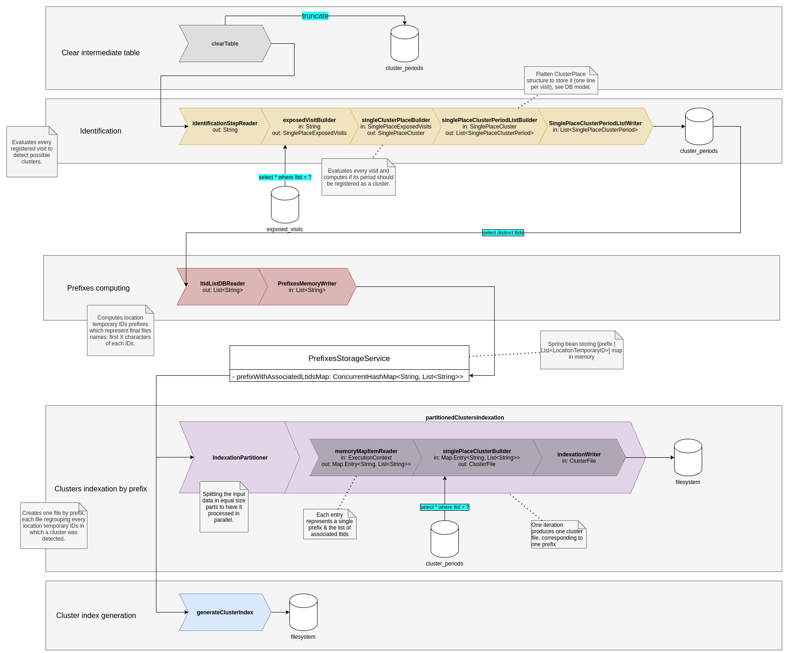

## Cléa Batch explainations

The batch component is to extract exposed visits recorded in database by the venue consumer component, computes 
the possible clusters that could have occurred, and outputs them as exploitable files for mobile phones to request.

Hereafter is a schema describing the different steps of the application. The system uses various spring batch mechanics
to implement an ETL pipeline, from exposed visits data to cluster files which are then uploaded to an S3 storage.

Each rectangle represents a job step, and each arrow inside represents a step component. In and Out data format details
are provided to help read the code.